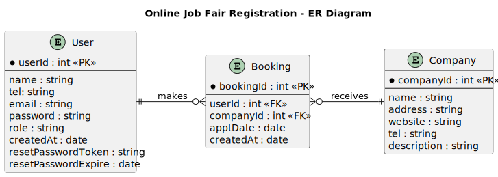
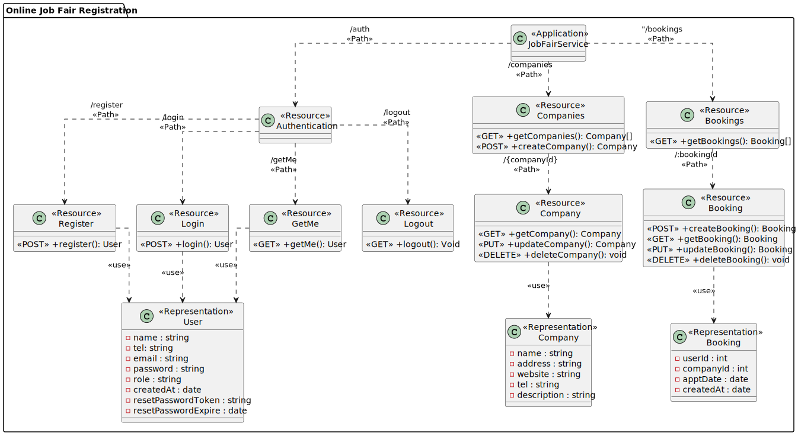

# Online Job Fair Registration

### Non-Functional Requirements

- Security:
    - The system shall authenticate users using usernamepassword.
    - The system shall be able to keep user’s transactions confidential.
- Performance:
    - The system shall response to a request in 3 seconds.
- Usability:
    - The system shall be used and test via Postman.

### Constraints

- The system shall be a web API.
- The frontend part of the application is not required.
- The development team shall develop the backend system as REST APIs.
- The database system can be either MongoDB Atlas or MySQL.

### Functional Requirements

1. The system shall allow a user to register by specifying the name, telephone number, email, and password.
2. After registration, the user becomes a registered user, and the system shall allow the user to log in to use the system by specifying the email and password. The system shall allow a registered user to log out.
3. After login, the system shall allow the registered user to book up to 3 interview sessions by specifying the date (during May 10th-13th, 2022) and the preferred companies. The company list is also provided to the user. A company information includes the company name, address, website, description, and telephone number.
4. The system shall allow the registered user to view his interview session bookings.
5. The system shall allow the registered user to edit his interview session bookings.
6. The system shall allow the registered user to delete his interview session bookings.
7. The system shall allow the admin to view any interview session bookings.
8. The system shall allow the admin to edit any interview session bookings.
9. The system shall allow the admin to delete any interview session bookings.

### Additional Requirements

1. The system shall allow registered users to set up their profiles, including GPA and work experience.
2. The system shall allow companies to view the profiles of users who book an interview session.
3. The system shall allow companies to cancel an interview session at least 24 hours in advance.

---

## Diagram

### ER Diagram

### Class Diagram

### Sequence Diagram

#### Auth
<!-- TODO -->

#### Company
<!-- TODO -->

#### Booking
<!-- TODO -->

---

## Demo: Functional Requirements
<!-- TODO -->